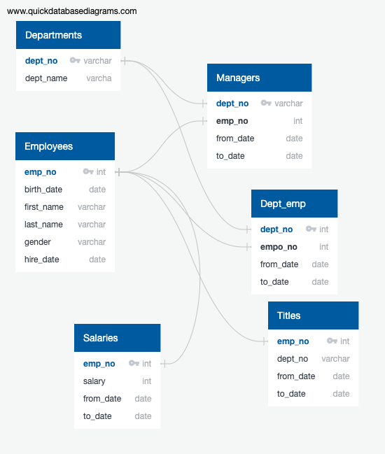

# Yu-Shuo-Nick-Module-7-SQL

#Project Summary
This project was composed of the application for SQL table. In this project we creat the new list of potential mentors,a list of current employees that are eligible for retirement , with the count of their recent titles . I performed a query that shows how many current employees of each title are presently eligible for retirement. In addition with a query that return the potential mentor's. The last query('potential mentor'), the challenge ask for hire date between '1965-01-01' to '1965-12-31'. Without confirming with the TA, I believe it meands birth_date instead. Since there is no one in the table has hire date between this period. Overall, the challenge's result table in .csv was store in the git hub challenge file. and the code for sql is in .sql.

The following will be the ERD in png,there has some deviation from this ERD. FOR example, the titles parameter was not list under the titles table. Due to the contents from the class shows differently.

The following will be the code for requested queries from part 1-3
--part_1 table 
SELECT e.first_name,
	e.last_name,
	ti.emp_no,
	ti.title,
	ti.from_date,
	s.salary
INTO employees_salary --export as name of Part_1.csv
	FROM titles as ti
	RIGHT JOIN employees as e
	ON(ti.emp_no=e.emp_no)
	RIGHT JOIN salaries as s
	ON(ti.emp_no=s.salary);
	

SELECT * FROM employees_salary;

--Part 1.2
--count the row for each duplicate name
SELECT
	first_name,
	last_name,
	count(*)
FROM employees_salary
GROUP BY
	first_name,
	last_name
HAVING count(*) >1;
--produce the row table for duplicate 
SELECT * FROM
	(SELECT*,count(*)
	OVER
	 (PARTITION BY
	 	first_name,
	 	last_name)
	 AS count FROM employees_salary
		) tableWithCount
	WHERE tableWithCount.count>1;
SELECT * FROM employees_salary;

DROP TABLE EMP_TITLE;

--Combine the duplicate row
SELECT 
first_name,
last_name,
salary,
from_date,
title
INTO EMP_TITLE
FROM employees_salary
GROUP BY
	first_name,
	last_name,
	salary,
	from_date,
	title
ORDER BY
	from_date DESC;
	
SELECT * FROM EMP_TITLE;
	
	
--DELETETING THE NULL values
DELETE FROM EMP_TITLE
WHERE first_name is NULL;

SELECT * FROM EMP_TITLE;

SELECT COUNT(emp.title),emp.title
INTO title_count
FROM EMP_TITLE as emp
GROUP BY emp.title;

SELECT * FROM title_count;

SELECT  tc.count,
		emp.first_name,
		emp.last_name,
		emp.salary,
		emp.from_date,
		emp.title
		INTO emp_title_count
		FROM EMP_TITLE as emp
		LEFT JOIN title_count as tc
		ON(emp.title=tc.title)
		ORDER BY emp.from_date DESC;

--Part 3 Who's Ready for a Mentor?

SELECT ep.emp_no,
		ep.first_name,
		ep.last_name,
		ep.birthdate,
		ti.title,
		ti.from_date,
		ti.to_date
		INTO mentor_ready --export as par_3
		FROM employees as ep
		INNER JOIN titles as ti
		ON(ep.emp_no = ti.emp_no)
		WHERE (ep.birthdate BETWEEN '1965-01-01'AND '1965-12-31')
		AND(ti.to_date='9999-01-01');
